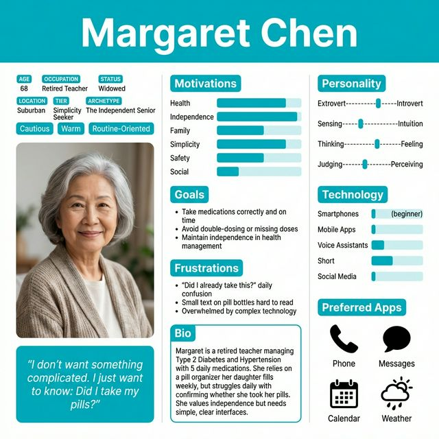
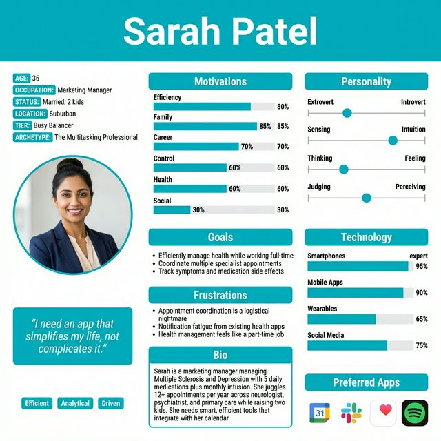

<div align="center">

#  Health Companion App
### *A UX Case Study on Designing for Chronic Health Management*

<br>

> *"I don't want something complicated. I just want to know: Did I take my pills? When is my next appointment? That's it."*
> 
> — **Margaret, 68** *(Research Participant)*

</div>

---

##  Overview

> **The Health Companion App** is a mobile application designed to help individuals with chronic health conditions manage their medications and appointments without the cognitive overload, notification fatigue, or accessibility barriers that plague existing solutions.
---

##  The Problem

Millions of people living with chronic conditions manage complicated daily health routines while balancing their lives. The tools available to them are fundamentally broken:

|  The Broken Tool |  The Reality of the Friction |
| :--- | :--- |
|  **Pill Organizers** | Cannot confirm *if* a dose was actually taken, leading to double-dosing fears. |
|  **Phone Alarms** | Quickly degrade into ignorable background noise after a single week. |
|  **Existing Apps** | Induce severe notification fatigue, leading to rapid app abandonment. |
|  **Paper Calendars** | Completely fail to prevent double-booking across siloed specialists. |

> ###  The Reality Check
> **76% of people with chronic conditions miss medications.**
> *The #1 reason? They simply forgot.*

Furthermore, appointment management is often a **"logistical nightmare,"** requiring coordination between 3–5 different specialists who operate in complete silos.

###  The Market Gap
Current solutions force a binary choice: **Too Simple** (glorified alarms) or **Too Complex** (overwhelming, bloated dashboards). Neither solves the actual daily friction, as illustrated in our initial user journey storyboards:

<br>

| 👵🏻 The Simplicity Seeker | 👩🏽‍💻 The Busy Balancer |
| :---: | :---: |
|  |  |
| *Margaret's friction is centered on confirmation and physical accessibility.* | *Sarah's friction is centered on logistical coordination and notification fatigue.* |

---
---

## The Solution: Adaptive Design

Rather than forcing a single interface on an imaginary "average user," the Health Companion App introduces **Adaptive UI Modes**.

| Mode | Target User | Key UX Decisions |
| :--- | :--- | :--- |
| 🟢 **Simple** | Tech beginners, seniors | 60pt+ touch targets, 24pt typography, voice cues, single-task screens |
| 🔵 **Standard** | Everyday users | Calendar sync, smart batch notifications, quick-tap logging |
| ⚫ **Advanced** | Power users | Deep data visualization, CSV health exports, symptom trend analysis |

#### ✨ Core Global Features
* ✅ **Time-stamped confirmation:** Solves the "did I take it?" anxiety.
* 📅 **Smart clustering:** Intelligent appointment scheduling.
* 📷 **OCR Scanning:** Frictionless onboarding via pill bottle camera scanning.
* 🤝 **Caregiver Portal:** Granular permission sharing for family members.
* 🌙 **"Bad Day Mode":** Ultra-low cognitive load UI for flare-ups and fatigue.

---

## Research & Discovery

### Methodology
To balance qualitative depth with quantitative scale, I utilized a mixed-methods approach:

| Method | Count | Duration | Format |
| :--- | :--- | :--- | :--- |
|  **Interviews** | 10 | 30–45 min | Semi-structured Video Calls |
|  **Surveys** | 50 | 5–7 min | Patient Advocacy Forums |
| **Total Cohort** | **60** | | |

**Demographic Snapshot:**
* **Age:** 18–75+ (Median: ~50) | **Gender:** 60% F / 40% M
* **Conditions:** Hypertension (56%), Diabetes (44%), Arthritis (28%), Heart Disease (24%)
* **Tech Literacy:** Expert (20%) | Comfortable (36%) | Basic (32%) | Beginner (12%)

---

### Qualitative Insights (The Interviews)

The emotion behind the data revealed deep anxieties surrounding medication management.

> *"I'll stand there staring at the organizer wondering, 'Did I take these already?' It's scary because with my blood pressure medication, you can't double up."*
> — **Margaret C., 68**

> *"On my worst days, I can barely get out of bed. I need something really easy to use even when I'm in brain fog."*
> — **Emily N., 45**

**Top Pain Points (N=10):**

| Severity | Impact Scale | User Pain Point |
| :---: | :--- | :--- |
| `10/10` | 🟥🟥🟥🟥🟥🟥🟥🟥🟥🟥 | Medication adherence |
| `09/10` | 🟧🟧🟧🟧🟧🟧🟧🟧🟧⬛ | Appointment coordination |
| `07/10` | 🟨🟨🟨🟨🟨🟨🟨⬛⬛⬛ | Fragmented systems |
| `06/10` | 🟩🟩🟩🟩🟩🟩⬛⬛⬛⬛ | Accessibility needs |
---

### Quantitative Validation (The Survey)

50 respondents quantified the exact scale of the problems identified in the interviews.

#### Adherence Breakdown
`76%` Miss medications at least sometimes
`76%` Cite forgetting as the primary reason
`64%` Rely on pure memory/routine (which fails)
`28%` Suffer from dosage/timing confusion

#### Feature Priorities
| Rank | Feature Request | Demand |
| :---: | :--- | :--- |
| **1** | Medication reminders | **88%** |
| **2** | Appointment reminders | **76%** |
| **3** | Medication tracking/history | **56%** |
| **4** | Doctor communication | **44%** |

#### Trust & Accessibility
* **72%** are extremely concerned about health data privacy.
* **64%** absolutely require large text and simple navigation.

---

### 8 Core Design Pillars

These synthesized findings serve as the absolute constraints for the UI/UX design phase:

1.   **Beyond Forgetting:** Adherence requires confirmation, timing, and visual ID.
2.   **Notification Harmony:** Over-notifying guarantees app abandonment.
3.   **Fluid Interfaces:** A 20% Expert / 44% Beginner split demands an adaptive UI.
4.   **Logistical Triage:** 40% juggle 7+ appointments/year; calendar sync is vital.
5.   **Bridging the Silos:** The app must centralize data from disconnected providers.
6.   **Accessibility First:** 56% have physical/visual needs; WCAG compliance is mandatory.
7.   **Bulletproof Privacy:** Data must be perceived (and built) as highly secure.
8.   **The Caregiver Loop:** 32% rely on family, necessitating a multi-user permission model.

## User Personas

Two data-driven personas were developed from the primary research, representing the two most underserved user segments in the current health-tech market. 

---

### 👵🏻 Persona 1: Margaret Chen — *The Simplicity Seeker*
> *"I don't want something complicated. I just want to know: Did I take my pills? When is my next appointment? That's it."*



**Demographics & Context**

| Age | Occupation | Tech Level | Lives With |
| :--- | :--- | :--- | :--- |
| 68 | Retired Teacher | 🟨 Beginner | Alone *(Daughter visits weekly)* |

** Health Profile**
* **Conditions:** `Type 2 Diabetes` `Hypertension`
* **Regimen:** 5 daily medications | 6–8 specialist appointments/year

**Core Goal:** Take medications correctly and on time without cognitive overload or confusion.

|  Pain Points |  What She Needs (Design Requirements) |
| :--- | :--- |
| • Daily *"Did I already take this?"* anxiety | • **Large Interface:** 60×60pt minimum touch targets |
| • Fear of dangerous double-dosing (BP meds) | • **Audio Cues:** Voice reminders for medications |
| • Small text on pill bottles is illegible | • **Clear Status:** Visual confirmation with timestamps |
| • Complex timing rules (with food, etc.) | • **Visual ID:** Medication photos for identification |
| • General technology anxiety | • **Support:** Caregiver sharing portal for her daughter |

* **Segment Representation:** ~30% of users (Ages 65–75+)*

---

### 👩🏽‍💻 Persona 2: Sarah Patel — *The Busy Balancer*
> *"I'm managing a complex condition while working full-time and raising kids. I need an app that simplifies my life, not complicates it."*



**Demographics & Context**

| Age | Occupation | Tech Level | Lives With |
| :--- | :--- | :--- | :--- |
| 36 | Marketing Manager | 🟦 Advanced | Husband + 2 children *(Ages 7 & 10)* |

** Health Profile**
* **Conditions:** `Multiple Sclerosis` `Clinical Depression`
* **Regimen:** 5 daily meds + 1 monthly infusion | 12+ appointments/year

** Core Goal:** Efficiently manage complex, overlapping health needs while maintaining career and family life.

|  Pain Points |  What She Needs (Design Requirements) |
| :--- | :--- |
| • Complex schedule (daily meds + 3hr infusions) | • **Automation:** Smart, calendar-aware notifications |
| • Coordinating 4+ siloed specialists | • **Frictionless:** One-tap medication logging |
| • Severe notification fatigue from other apps | • **Logistics:** Appointment clustering to save time |
| • Tracking symptoms alongside side-effects | • **Ecosystem:** Native Google Calendar integration |
| • Health management feels like a "part-time job" | • **Insights:** Data visualization and symptom trends |

* **Segment Representation:** ~40% of users (Ages 33–58)*

---

### Persona Comparison: The Creative Tension

*The stark contrast between these two personas created our primary design constraint. Every feature, flow, and UI element had to be validated against both extremes to ensure the "Adaptive Design" framework actually worked.*

| Attribute | 👵🏻 Margaret *(The Simplicity Seeker)* | 👩🏽‍💻 Sarah *(The Busy Balancer)* |
| :--- | :--- | :--- |
| **Age & Tech Level** | 68 \| 🟨 Beginner | 36 \| 🟦 Advanced |
| **Target UI Mode** | 🟢 Simple Mode | 🔵 Standard / Advanced Mode |
| **Primary Need** | Foolproof medication reminders | Efficient, holistic health management |
| **Key Feature** | Huge buttons + voice reminders | Smart notifications + data visualization |
| **Main Fear** | "Did I take my medication?" *(Double dosing)* | Running out of time *(Logistical failure)* |
| **Success Metric** | Confidence + Adherence | Time Saved + Symptom Insights |

---

## User Journey Maps

### Margaret's 7-Stage Journey

Margaret's journey begins with **skepticism** and ends with her becoming an **advocate**.

| Stage | Scenario | Emotion | Design Response |
|---|---|---|---|
| 1. Discovery | Daughter notices medication confusion | Skeptical → Curious | N/A |
| 2. Onboarding | Daughter helps set up at kitchen table | Overwhelmed → Relieved | Progressive 3-step onboarding, large text |
| 3. First Use | 7:00 AM — first independent reminder | Nervous → Proud | Voice reminder → pill photo → "I TOOK IT" → green checkmark |
| 4. Week 1 | Twice-daily logging becomes routine | Confident → Proud | Caregiver notifications, positive reinforcement |
| 5. Appointment | 3-day reminder before Dr. Smith visit | Relieved → Prepared | Multi-stage reminders, printable medication list |
| **6. Key Moment** | 10:00 AM — "Did I take my pills?" | **Anxious → Relieved** | Opens app: "Morning meds — Taken ✓ at 7:05 AM" |
| 7. Long-term | App is daily companion; she recommends it | Confident → Advocate | 98% adherence, zero missed appointments |

**Margaret's Emotional Arc:**
```
Skeptical → Anxious → Accomplished → Confident → Grateful → Advocate
   😟         😰          🙂            😊           ❤️          🌟
```


**The killer moment:** Stage 6. Margaret opens the app at 10:00 AM wondering if she took her pills. She gets an instant answer: *"Morning medications, All taken ✓ 7:05 AM."* Her anxiety dissolves in seconds. This single feature: immediate, timestamped confirmation, became the central value proposition for the Simplicity Seeker segment.

---

### Sarah's 7-Stage Journey

Sarah's journey is driven by **efficiency** and discovering that the app can actually **learn her life**.

| Stage | Scenario | Emotion | Design Response |
|---|---|---|---|
| 1. Discovery | Searching "best medication tracking app" during lunch | Frustrated → Analytical | Impressed by integration list |
| 2. Onboarding | Downloads during subway commute | Rushed → Impressed | Google sign-in + OCR = under 10 min setup |
| 3. First Day | Busy workday with back-to-back meetings | Relieved → Hopeful | App delays reminder until meeting ends |
| 4. Week 1 | Discovers data insights before neurologist visit | Surprised → Curious | "My fatigue is worse on days with more meetings" |
| **5. Key Moment** ⭐ | Needs to schedule infusion + neurologist + lab | **Frustrated → Amazed** | App clusters 3 appointments, saves 2 hours travel |
| 6. Bad Day | Severe MS fatigue + brain fog | Anxious → Supported | One tap → simplified interface + husband notified |
| 7. Long-term | Power user, 97% adherence, sends feature feedback | Satisfied → Engaged | "Less time managing health, more time with kids" |

**Sarah's Emotional Arc:**
```
Frustrated → Impressed → Satisfied → Surprised → Delighted → Grateful → Advocate
    😤          😲          🙂          😲          🌟          ❤️          🎯
```


**The killer moment:** Stage 5. Sarah needs to schedule three separate medical appointments while her work calendar is packed. The app analyzes her calendar, finds the optimal day, and clusters all three appointments saving her two hours of travel. This appointment clustering feature became the defining value for the Busy Balancer segment.

---

## 🎬 Storyboards & Conceptualization

To map out the emotional and practical journey of our personas, I developed storyboards to visualize the app in real-world contexts. 

### 👵🏻 Scenario A: Margaret's Morning Routine


> ✨ **Flow:** Voice Reminder ➔ Visual Pill Photo ➔ Oversized Action Button ➔ Timestamp Confirmation

---

### 👩🏽‍💻 Scenario B: Sarah's Appointment Scheduling & Additional Flows
*To save vertical space, these journey mappings are displayed as a unified storyboard gallery.*

| Appointment Scheduling | Symptom Tracking | Caregiver Sync | Bad Day Mode |
| :---: | :---: | :---: | :---: |
|  |  |  |  |

> ✨ **Flow:** Calendar Integration ➔ Intelligent Clustering ➔ Time-Savings Visualization ➔ Prep Checklists

---

## Wireframes & Architecture

Before drawing a single screen, I established a strict, mode-based design system to ensure absolute consistency across the Simple, Standard, and Advanced interfaces.

### The Adaptive Design System

| Element | 🟢 Simple Mode | 🔵 Standard Mode | ⚫ Advanced Mode |
| :--- | :--- | :--- | :--- |
| **Body Typography** | 18–24pt | 16pt | 14pt |
| **Headings** | 32pt+ | 24pt | 20pt |
| **Minimum Text** | 18pt | 14pt | 12pt |
| **Touch Targets** | 60×60pt *(80pt for primary)* | 44×44pt *(Apple HIG)* | 44×44pt |
| **Accessibility** | WCAG AA *(4.5:1 Contrast)* | WCAG AA | WCAG AA |

---

### 📱 Core Screen Architecture


#### 01 / Welcome & Mode Selection
Three mode cards are presented at launch with clear, plain-language descriptions. A *"Need help? Invite a family member"* option supports caregiver-assisted setup for users like Margaret.
> 🔬 **Research Insight:** 73% of participants worried about app complexity on first use.

<br clear="all" />
<br>


#### 02 / Home Dashboard
The home screen opens with a personalized greeting and puts "Today's Medications" at the very top—because that's the question users are asking the moment they open the app. Color-coded status indicators and timestamps eliminate all ambiguity.
> 🔬 **Research Insight:** Built to solve the #1 *"Did I take it?"* question in under 5 seconds.

<br clear="all" />
<br>


#### 03 / Dashboard (Alternate Quick View)
A Quick Actions 2×2 grid offers fast navigation to *My Health*, *Appointments*, *Settings*, and *Help*—making core features instantly accessible without hunting through nested hamburger menus.

<br clear="all" />
<br>


#### 04 / Medication Directory
Each medication card shows a photo for visual identification, special instructions *(e.g., "Take with food")*, and a color-coded status indicator. Filter chips help users seamlessly browse by *All / Daily / As-needed / Weekly*.
> 🔬 **Research Insight:** 6/10 interview participants struggled to identify their medications by chemical name alone.

<br clear="all" />
<br>


#### 05 / Add Medication (OCR Scan)
A dual-input system defaults to camera scanning. The OCR reader auto-detects medication name, dosage, and form directly from the pill bottle, eliminating the high-error-rate manual text entry that corrupts health records.

<br clear="all" />
<br>


#### 06 / Active Reminder State
The reminder screen has one dominant action: a full-width green **"I TOOK IT"** button. The medication photo is enormous. Secondary options are visually de-emphasized to prevent accidental taps. Includes a 30-second "Undo" window.
> 🔬 **Research Insight:** A single, massive CTA reduces cognitive load; immediate confirmation quells anxiety.

<br clear="all" />
<br>


#### 07 / Daily Medication Log
The log page opens with the instant answer at the top: *"All medications taken ✓"* or a specific count of what's pending. A chronological timeline layout with timestamps paints the full picture.

<br clear="all" />
<br>


#### 08 / Appointment Directory
Appointment cards automatically generate preparation checklists *(bring insurance card, medication list, notes for doctor)*. Multi-stage reminders *(3 days, 1 day, morning-of)* configure automatically based on the appointment type.

<br clear="all" />
<br>


#### 09 / Smart Scheduling Engine
The scheduling assistant analyzes the user's connected calendar to suggest optimal days. When multiple appointments are needed, it proposes clustering them to save travel time, displaying concrete metrics: *"💰 Save 2 hrs travel / Save $15 parking."*
> 🔬 **Research Insight:** Directly targets Sarah's #1 pain point: coordination across 4+ specialists.

<br clear="all" />
<br>


#### 10 / Settings & Accessibility
Mode switching, text size with live preview, high contrast toggles, voice commands, and caregiver connection management are all surfaced beautifully. Critical accessibility features are never hidden.

<br clear="all" />

---
## 📱 High-Fidelity Prototype

The final interactive prototype was constructed in **Figma**, specifically optimized and scaled for the **iPhone 17 Pro** display.

[](https://www.figma.com/design/NAPWQgbW47pHnod1PSxhqm/Untitled?node-id=0-1&t=RqtKJFwCyFmmnI4S-1)

|  **Scope** |  **Interactivity** |  **Motion Design** |
| :--- | :--- | :--- |
| **~30** Core Frames | **50–70** Clickable Hotspots | Smart Animate, Dissolve, Slide |

###  Core User Flows
*Mapping the exact tap-by-tap journey for our primary use cases.*

**01 / First-Time Onboarding** *(8 Screens)*
> `Welcome` ➔ `Mode Selection` ➔ `Profile` ➔ `OCR Scan` ➔ `Verify` ➔ `Notif. Prefs` ➔ `Success` ➔ `Home`

**02 / Medication Management** *(5 Screens)*
> `Home Dashboard` ➔ `Medication List` ➔ `Add Med` ➔ `Active Reminder` ➔ `Logged Confirmation`

**03 / Appointment Scheduling** *(7 Screens)*
> `Appointments` ➔ `Add New` ➔ `Smart Dates` ➔ `Clustering Proposal` ➔ `Optimized Schedule` ➔ `Book` ➔ `Success`

**04 / Settings & Accessibility** *(3 Screens)*
> `Settings Menu` ➔ `Mode Toggle` ➔ `Invite Caregiver`

---

##  Usability Testing Plan

Before handing off to development, the prototype must be validated against real users to ensure our "Adaptive Design" hypothesis holds up under friction.

###  Testing Objectives
|  Primary Goals (Functional) |  Secondary Goals (Attitudinal) |
| :--- | :--- |
| **1.** Verify task completion across all core flows | **4.** Gauge perceived value and adoption intent |
| **2.** Assess first-time learnability without instruction | **5.** Understand notification preferences |
| **3.** Validate accessibility for *Simple Mode* users | **6.** Capture emotional response and NPS |
| **4.** Identify error-prone interaction points | |

###  Participant Matrix
* **Cohort Size:** 5–8 participants per iterative round.
* **Demographics:** Age mix of 30–45 *(The Busy Balancers)* and 60–75+ *(The Simplicity Seekers)*.
* **Tech Literacy Split:** Minimum 2 Beginner/Basic + 2 Intermediate/Advanced users per round.

###  Task Scenarios & Metrics

| # | Task Scenario | Key Metric / Success Indicator |
| :---: | :--- | :--- |
| **1** | Complete first-time onboarding | Completion rate, time-on-task, drop-off rate |
| **2** | Log a medication from a reminder | Time to tap, post-task confidence rating |
| **3** | Answer: *"Did I take my morning meds?"* | Time to answer *(Target: <5 seconds)* |
| **4** | Add a new medication via OCR scan | Completion rate, manual correction count |
| **5** | Schedule 3 clustered appointments | Clustering comprehension, total time saved |
| **6** | Invite caregiver with view-only access | Feature discoverability, privacy confidence |

###  Baseline Success Criteria
`≥ 85%` Task Completion Rate  
`≥ 70` System Usability Scale (SUS) Score  
`≤ 2.5` Average Task Difficulty *(5-pt Likert Scale)* `4/5` "Did I take it?" Confidence Score  
`0` Critical Blocking Errors  

---
## Key Design Decisions

Great UX is about justification. Every major feature in the Health Companion App traces directly back to a specific, quantifiable research finding. 

<br>

### 01 / The Adaptive Three-Mode Interface
|  The Insight |  The Problem |  The Innovation |  The Impact |
| :--- | :--- | :--- | :--- |
| Our research showed a massive tech literacy gap: **44% Beginner vs. 20% Expert**. | A single interface would either overwhelm Margaret or under-serve Sarah. | Mode selection at onboarding *(Simple, Standard, Advanced)*, switchable anytime. | Margaret gets a foolproof 3-option screen; Sarah gets deep data dashboards. |

<br>

### 02 / Timestamped Confirmation System
|  The Insight |  The Problem |  The Innovation |  The Impact |
| :--- | :--- | :--- | :--- |
| **10/10** interview participants experienced chronic *"Did I take it?"* anxiety. | Existing solutions (like pill boxes or alarms) offer zero proof of a completed action. | Every logged dose receives a permanent, highly visible timestamp on the dashboard. | Margaret's core anxiety is definitively resolved within 3 seconds of opening the app. |

<br>

### 03 / Smart (Not Dumb) Notifications
|  The Insight |  The Problem |  The Innovation |  The Impact |
| :--- | :--- | :--- | :--- |
| **30%** of participants had abandoned previous health apps due to notification overload. | Generic alarms get ignored; too many reminders cause rapid app deletion. | Context-aware reminders that escalate *(gentle ➔ persistent)* and respect quiet hours. | Notifications are perceived as a helpful assistant, not a harassing alarm clock. |

<br>

### 04 / Appointment Clustering Engine
|  The Insight |  The Problem |  The Innovation |  The Impact |
| :--- | :--- | :--- | :--- |
| **90%** of users cited coordination as a major pain point; 40% juggle 7+ appts/year. | Scheduling 3–4 disconnected specialists requires hours of tedious calendar juggling. | The app analyzes work calendars and proposes clustering appointments on the same day. | Sarah's #1 time-sink is solved automatically, saving significant travel time and PTO. |

<br>

### 05 / "Bad Day Mode"
|  The Insight |  The Problem |  The Innovation |  The Impact |
| :--- | :--- | :--- | :--- |
| *"On my worst days, I can barely get out of bed."* — **Emily, 45** | The physical reality of illness makes managing the logistics of illness significantly harder. | A one-tap mode that strips the UI down to bare essentials and auto-notifies a caregiver. | Users are supported with absolute zero cognitive load exactly when they need it most. |

<br>

### 06 / Accessibility-First Infrastructure
|  The Insight |  The Problem |  The Innovation |  The Impact |
| :--- | :--- | :--- | :--- |
| **56%** of our users have a documented accessibility need *(visual or motor)*. | Accessibility features are usually hidden in nested "Settings" menus as an afterthought. | Huge touch targets, WCAG AA contrast, and voice cues are baked into the core architecture. | Features designed explicitly for Margaret benefit all users under stress or distraction. |

## Reflections & Takeaways

### The Paradigm Shift
The most crucial insight from this project was realizing that every good design decision must be *pulled* out of user research, not invented in a vacuum. 

Before the interviews, my baseline assumption was that users simply "forget" their medication and just need a reminder. The research revealed a much more nuanced reality. Users were battling four distinct systemic failures:

|  Confirmation |  Identification |  Timing |  Complexity |
| :--- | :--- | :--- | :--- |
| *"Did I already take it?"* | *"Which pill is this?"* | *"With food? Before bed?"* | *"This schedule is overwhelming."* |

>  **The Epiphany:** If I had designed based on my initial assumption, I would have just built a better alarm clock. By listening to the data, I designed a **confirmation system**—and that is a fundamentally different product.

---

###  Challenges & Strategic Solutions

| The Design Challenge | The Solution |
| :--- | :--- |
| **1. The Persona Paradox**<br>Margaret needs extreme simplicity, while Sarah needs powerful efficiency features. No single interface satisfies both extremes. | **Adaptive Architecture:** The three-mode system ensures both Margaret and Sarah get an experience that feels custom-built for them—because it is. |
| **2. The Reminder Dilemma**<br>The app's core value is reminders, but notification fatigue is the #1 reason users abandon health apps. | **Smart Escalation:** One gentle reminder initially, escalating to persistent *only* if ignored. Calendar-awareness mutes alerts during meetings. |
| **3. Scope Creep & Bloat**<br>24 prioritized features and 10+ distinct pain points could easily mutate into a bloated, unusable prototype. | **Ruthless Prioritization:** Using a P0–P3 matrix. Core value flows (P0) got dedicated screens. Nice-to-haves were deferred. The app does fewer things, but does them excellently. |

---

###  Core UX Takeaways

*The five guiding principles I will carry forward into my next role.*

| | Core Principle | The Real-World Application |
| :---: | :--- | :--- |
| <br>`01` | **Research prevents assumption-driven design.** | The *"Did I take it?"* timestamp confirmation is the beating heart of this app. It never would have existed without those 10 semi-structured interviews. |
| <br>`02` | **Personas are decision tools, not deliverables.** | They aren't just PDFs for a portfolio. Every UI conflict was instantly resolved by asking: *"Does this work for Margaret? Does it work for Sarah?"* |
| <br>`03` | **Journey maps reveal what wireframes miss.** | The high emotional stakes of Margaret's first independent morning routine only emerged from journey-level thinking, not screen-level UI design. |
| <br>`04` | **Accessibility benefits everyone.** | The "Curb-Cut Effect" is real. Features designed for the most constrained user *(huge touch targets, voice UI)* naturally raised the ease-of-use for all users. |
| <br>`05` | **Scope discipline is a core design skill.** | Knowing exactly what to leave *out* of a product is just as important as knowing what to include to prevent feature bloat. |

---

*Health Companion App — SOEN 357 Final Mini Project, Concordia University*  
*Ranjit Singh Dhunna — February 2026*
